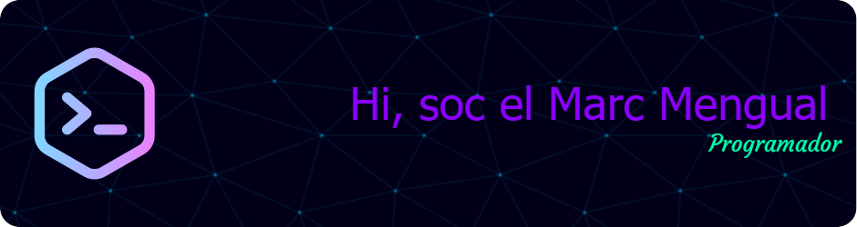

<h3>Links Informativos</h3>

- Contactame: **mengualmarcgesti@gmail.com**

- Curriculum: [Curriculum](https://drive.google.com/file/d/17cAyvmDolAMWCJCGojNiMb6TPnvxUhsI/view?usp=sharing)

<h3>Quien soy?</h3>

Soy un entusiasta de la tecnología en todas sus facetas, siempre buscando cómo convertir mi pasión en una carrera profesional. Me interesa el entorno tecnológico desde diferentes ángulos: ya sea en el ámbito empresarial, el mundo del gaming o en el uso cotidiano de dispositivos. Disfruto explorando nuevas tendencias y herramientas, con el deseo de estar siempre al tanto de lo último en innovación tecnológica.

Tengo experiencia en el mantenimiento tanto de hardware como de software, lo que me ha permitido entender a fondo el funcionamiento de los dispositivos y cómo optimizarlos. Desde desarmar ordenadores para solucionar problemas de hardware hasta configurar software en diversos dispositivos, siempre me ha gustado resolver problemas y mejorar el rendimiento de las máquinas. Esto me da una visión integral de cómo interactúan el software y el hardware, algo que encuentro fascinante.

En cuanto a la programación, he trabajado con lenguajes como Java y C#, y plataformas como MySQL y Unity. Estas experiencias me han permitido no solo desarrollar habilidades técnicas, sino también aplicar la creatividad y el pensamiento lógico en proyectos de software, ya sea en el desarrollo de aplicaciones o en la creación de videojuegos. El desarrollo de videojuegos, en particular, combina dos de mis grandes pasiones: la tecnología y el entretenimiento interactivo.

Siempre estoy en constante adaptación. Me motiva aprender y mantenerme al día en un mundo que cambia tan rápido, y hoy en día he estado explorando cómo la Inteligencia Artificial puede ser una herramienta clave en el trabajo. Creo firmemente que la IA no solo es el futuro, sino que es una herramienta increíble para automatizar tareas, aumentar la eficiencia y abrir nuevas posibilidades que antes parecían inalcanzables.

Me veo como una persona curiosa, que no solo disfruta trabajando con la tecnología, sino que también ve en ella un medio para crear, innovar y resolver problemas. El deseo de seguir aprendiendo y mejorando es lo que me impulsa cada día.

<h3>Proyectos Trabajados</h3>

- [UrFungi](https://github.com/Voldwyce/Urfungi)

Una aplicación con caracteristicas de una red social creada en un proyecto academico con intenciones de hacer un rediseño junto a nuevas funcionalidades y interfaz. La aplicación tiene funcionalidades como un sistema de posts con likes y comentarios, un chat privado, un sistema de amigos, cuestionarios con puntuación global, interacción con diferentes APIs.

- [Selmeems](https://github.com/MarcMengual/Selmeem)

Una red social creada en un proyecto academico, la aplicación se especializa en tener un perfil con personalizaciones y publicacion de imagenes, estas publicaciones pueden recibir tanto likes como comentarios.

<h3 align="left">Lenguajes y herramientas utilitzadas:</h3>

           

